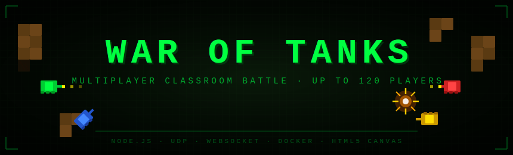

# War of Tanks

<p align="center">
  
</p>
<p align="center">
  
</p>

[](https://github.com/JosepTomasComellas/WarOfTanks/actions/workflows/docker-publish.yml)

Joc de batalla de tanks en xarxa per a competicions d'aula.  
Fins a **120 jugadors simultanis** · Protocol UDP port 8888 · Estètica retro arcade.

---

## Desplegament ràpid

### Servidor (professor)

```bash
docker compose -f docker-compose.server.yml up -d
```

Obtén la IP de la màquina (`ipconfig` / `ip addr`) i comunica-la als alumnes.

### Client (cada alumne)

1. Descarrega `docker-compose.yml` i `.env.example`
2. Copia `.env.example` → `.env` i edita la IP:

```env
SERVER_IP=192.168.1.50
```

3. Arranca i obre el navegador:

```bash
docker compose up -d
# → http://localhost:8888
```

Consulta el **[MANUAL.md](MANUAL.md)** per a la guia completa pas a pas (Ubuntu Server + Windows Docker Desktop).

---

## Tecnologia

| Component | Tecnologia |
|-----------|------------|
| Servidor de joc | Node.js + UDP (`dgram`) |
| Proxy client | Node.js + WebSocket (`ws`) |
| Interfície web | HTML5 Canvas + JS pur |
| So | Web Audio API (sense fitxers externs) |
| Transport en xarxa | UDP port 8888 |
| Contenidors | Docker · imatge única |

## Mecànica

- Mapa generat aleatòriament cada ronda (cel·les + corredors, 80×60 tiles)
- 3 vides per jugador · reaparició automàtica
- +100 pts per eliminació · +500 pts per guanyar la ronda
- Leaderboard en temps real · panell d'administrador per al professor

## Llicència

MIT · Projecte educatiu Salesians
